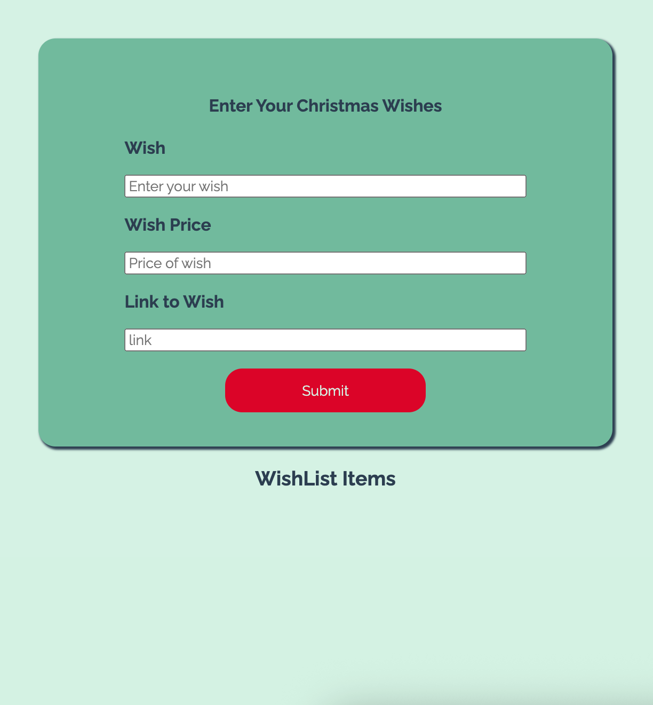

# Christmas List
> This is a cute CRUD app designed to keep track of christmas gifts and wishes.
> Live demo [_here_](https://christmas-list-jndl.onrender.com/). <!-- If you have the project hosted somewhere, include the link here. -->

## Table of Contents
* [General Info](#general-information)
* [Technologies Used](#technologies-used)
* [Features](#features)
* [Screenshots](#screenshots)
* [Setup](#setup)
* [Usage](#usage)
* [Project Status](#project-status)
* [Room for Improvement](#room-for-improvement)
* [Acknowledgements](#acknowledgements)
* [Contact](#contact)
<!-- * [License](#license) -->

## General Information
- The problem this app solves is to make the task of christmas shopping a little easier.
- The purpose is to store a list of gifts that your loved one would like to receive.
- I undertook this project to help me keep track of gifts to buy this christmas. 

## Technologies Used
- React 19 - version 19.2
- Vite - version 7.1.5

## Features

- Awesome feature 1 - Add gifts
- Awesome feature 2 - Delete gifts
- Awesome feature 3 - Edit gifts
- Awesome feature 4 - Sort gifts according to price
- Awesome feature 5 - Total gifts
- Awesome feature 6 - Tag and Filter purchased gifts

## Screenshots

<!-- If you have screenshots you'd like to share, include them here. -->

## Setup
What are the project requirements/dependencies? Where are they listed? A requirements.txt or a Pipfile.lock file perhaps? Where is it located?

Proceed to describe how to install / setup one's local environment / get started with the project.

## Usage
How does one go about using it?
Provide various use cases and code examples here.

`write-your-code-here`

## Project Status
Project is: _in progress_ 

## Room for Improvement
Include areas you believe need improvement / could be improved. Also add TODOs for future development.

Room for improvement:
- Animations for christmas theme such as snow
- Add sound to button when clicked

To do:
- Implement dash for multiple users

## Acknowledgements
Give credit here.
- Many thanks to Parsity for mentoring and supporting me in my coding journey

## Contact
Created by [@laurenAmolloy](https://www.linkedin.com/in/lauren-a-molloy/) - feel free to contact me!

<!-- Optional -->
<!-- ## License -->
<!-- This project is open source and available under the [... License](). -->

<!-- You don't have to include all sections - just the one's relevant to your project -->
